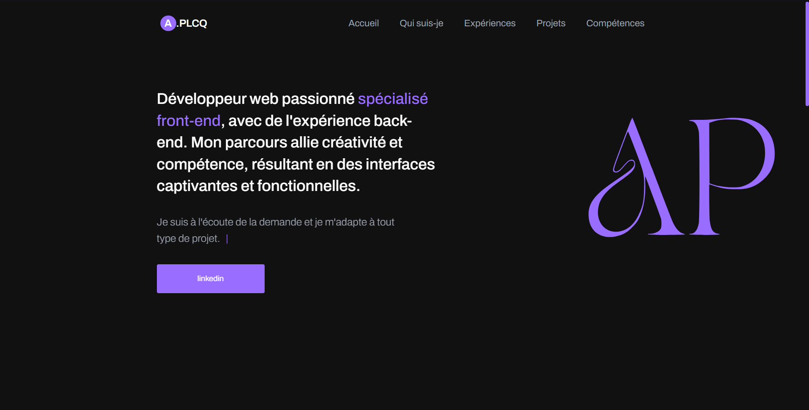

# Portfolio - A-PLCQ

Bienvenue sur mon portfolio ! Ce projet est une vitrine de mes compétences, expériences et réalisations en tant que développeur.

## Accueil
Dans cette section, vous trouverez une brève présentation de ma personne ainsi qu'une description de mes objectifs et de ma vision.

## Qui suis-je
Je suis passionné par le développement web et les technologies émergentes. Mon objectif est de créer des solutions innovantes qui résolvent des problèmes concrets.

## Expériences
Cette partie met en avant mon parcours professionnel au sein d'entreprises. J'y partage les expériences et les connaissances que j'ai acquises en travaillant sur divers projets.

## Projets
Dans cette section, vous découvrirez quelques-uns des projets sur lesquels j'ai travaillé. Chaque projet est accompagné d'une description et de liens vers les dépôts correspondants.

## Compétences
Ici, je mets en évidence mes compétences en développement web et en programmation. Des technologies front-end telles que HTML, CSS et JavaScript sont au cœur de mes compétences.

## Technologies Utilisées
- HTML
- CSS
- JavaScript

## Capture d'écran

## Contact
N'hésitez pas à me contacter si vous avez des questions, des commentaires ou des opportunités de collaboration :
- Email : votre@email.com
- LinkedIn : [votre profil LinkedIn](https://www.linkedin.com/in/augustin-plumecocq/)

## Note
Ce portfolio est une page unique qui présente de manière concise mes compétences et mon parcours. Il est en constante évolution au fur et à mesure que j'acquiers de nouvelles connaissances et expériences.

---

**Remarque :** Ce projet de portfolio est conçu comme une page unique et ne nécessite aucune installation particulière. Vous pouvez simplement le consulter en ouvrant le fichier `index.html` dans votre navigateur.

Sentez-vous libre de parcourir mon portfolio et de me contacter si vous avez des retours ou des questions. Merci d'avoir visité mon portfolio !
